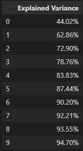
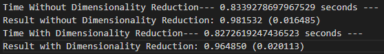

<h1> ETH - Dimensionality Reduction </h1>

    <h4> The main goal of this project is to show how to apply dimensionality reduction using Singular Value Decomposition, which is classified under Unsupervised Learning. The idea behind this project is to reduce the number of features, given a dataset that has a lot of dimensions and enhance computation speed of an algorithm while retaining 95% of the variance and high accuracy. </h4>
     
    <h4> Below is the result of using PCA with TruncatedSVD method to transform the full dataset into set of eigenvalues. Here, we've preserved close to 95% variance of our data in just 9-10 Eigenvalues, which is great compared to the original 30+ features. This is very useful compression for the analysis and iterations of the model.
    
    
      
    <h2>I used a Random Forest Classification algorithm for the ETH prediction and evaluated the model with accuracy scoring.
    </h2>
    
     
    <h4> We evaluate the model with and without Dimensionality, as well as the result of our classification algorithm From the image shown above, we can see that time has only improved just slightly, but this is understandable because it's just a simple dataset and model. If we were to be working with extremely large dataset, this PCA method would extremely helpful. If we look at the result of with/without Dimensionality, we see that the accuracy score is only 1.5% off from each other, meaning that using Dimensionality Reduction will still yield similar result with quicker computation and high accuracy compared to without PCA. :D </h4>

<h6> None of this is considered financial advice, I will not be responsible for any transactions involving crypto or stock market. This is for educational purposes only. </h6>
