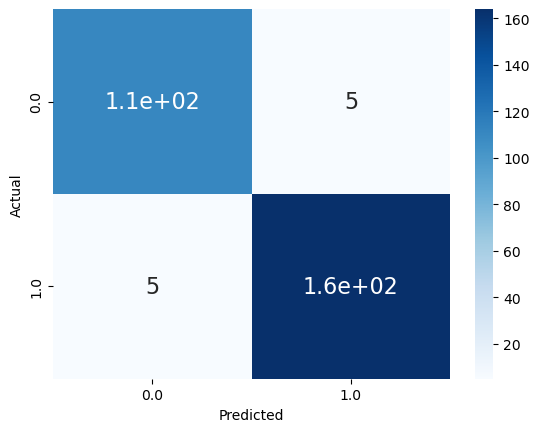

<h1> ETH Basic Prediction Bot </h1>

    <h4> The main goal of this project is to show the elements of prediction using ETH dataset webscraped from CoinMarketCap. The idea behind this project is to find more useful features from professional traders and apply it using Machine Learning. This time, we evaluate the potential backtest trading strategy on Ethereum mostly for an investment approach. This lets us analyze risk and profitability before risking any actual capital. </h4>
     
    <h4> Below is the result of feature importance to find which features are highly correlated with the signal (Target Variable). 
    
    <h4>Here we can see that the following were mostly correlated: </h4>
    <li> %D, %K, ROC, MOM of 50 days </li>
    <li> %D, %K, Stochastic RSI of 100 days </li>
    <li> MACD </li>
    <li> RSI of 100 days </li>
      
    <h2>I used a Random Forest classification algorithm for the basic ETH prediction and evaluated the test set with accuracy scoring.</h2>
    
     
    <h4> The Backtest result:</h4>
    
    <h4>We don't deviate significantly from the actual market return, just a different magnitude, but even then, this strategy helps us become better at predictiong price direction for profit returns. However, our accuracy isn't 100%, but more than 95%, it made us have relatively few losses compared to the actual return. </h4>

<h6> None of this is considered financial advice, I will not be responsible for any transactions involving crypto or stock market. This is for educational purposes only.</h6>
