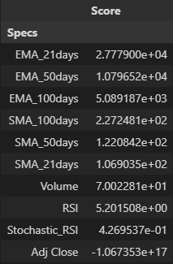

<h1> ETH Basic Prediction Bot </h1>

    <h4> The main goal of this project is to show the basic element of prediction using ETH dataset webscraped from CoinMarketCap. The idea behind this project is to find some useful features from professional traders and apply it using Machine Learning. </h4>
     
    <h4> Below is the result of selectKbest to find which features are highly correlated with the closing column (Target Variable).
    
      
    <h2>I used a Random Forest Regressor algorithm for the basic ETH prediction and evaluated the model with R2 scoring.</h2>
    
     
    <h4> Note that this does not cover the whole features that needs to be feature engineered, I only applied the basic principles of Machine Learning for my own knowledge. If you want to learn more about feature implimentation, you can search on investopedia and create the custom features, much like how I've set some of them up in one of my notebooks.

<h6> None of this is considered financial advice, I will not be responsible for any transactions involving crypto or stock market. This is for educational purposes only.</h6>
