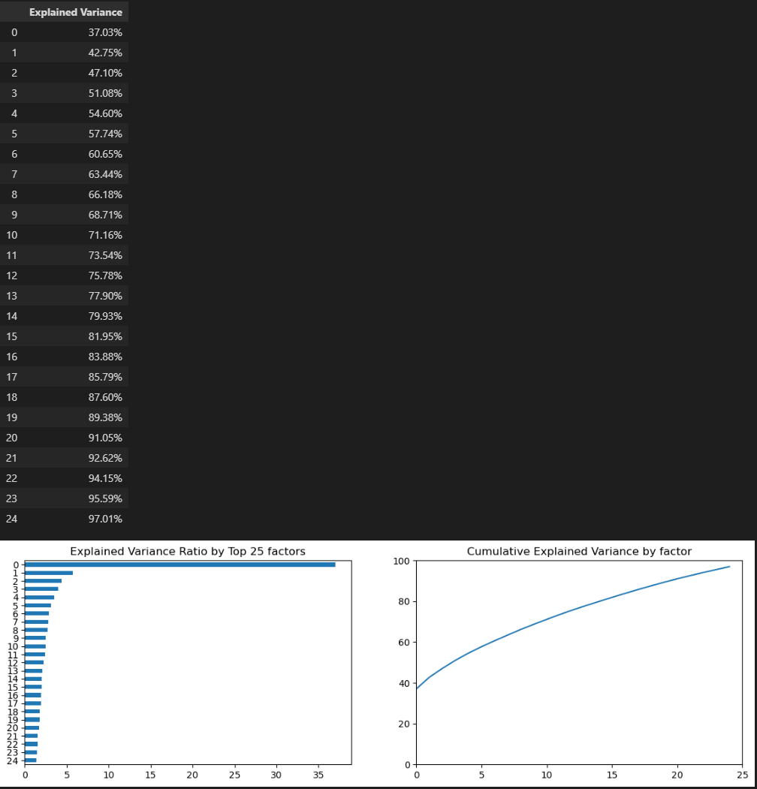
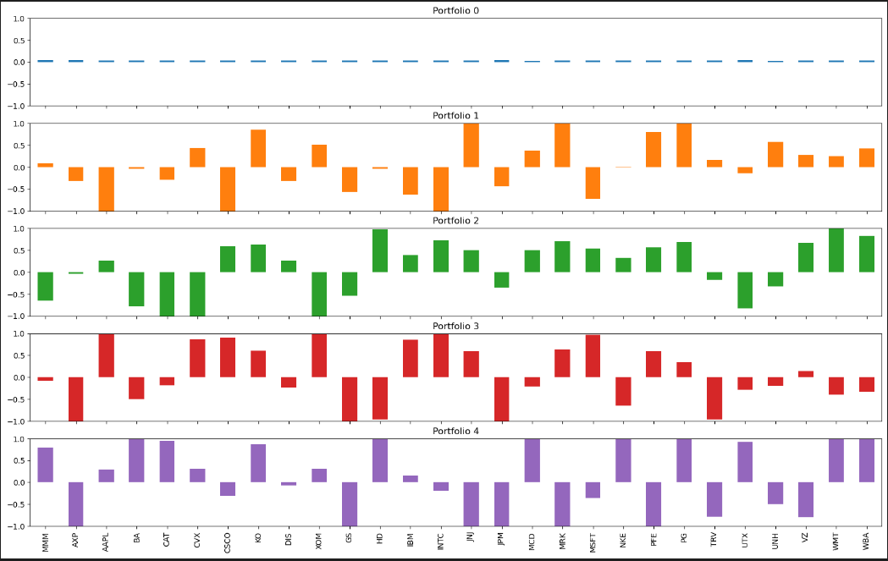
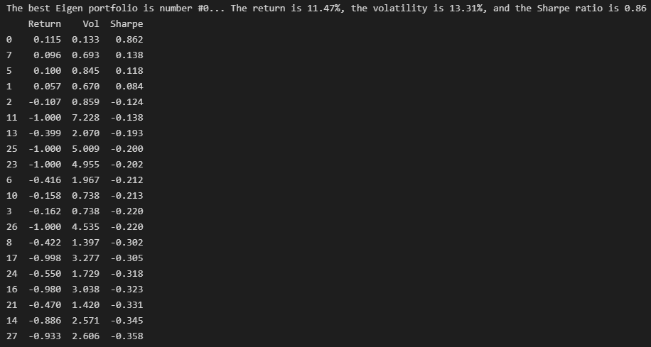
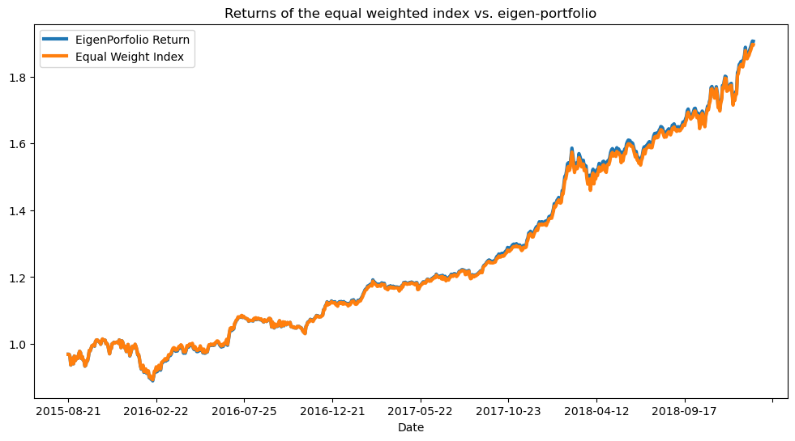

<h1> DOW30 Trading Strategy - Eigen Portfolio with Sharpe Ratio (Unsupervised Learning) </h1>

    <h4> The main goal of this project is to maximize risk-adjusted returns of an equity DOW30, and apply PCA as a trading strategy with Sharpe Ratio as the key focus. DOW Historical data can be downloaded from Yahoo Finance. We will evaluate the performance of the Eigen Portfolio with the benchmark (equal weighted index). </h4>
     
    <h4> Below is the result of using PCA method to transform the full dataset into set of eigenvalues. Here, instead of trying to retain 95% variance, we want to decompose the dataset into separate portfolios and analyze our features within each of these portfolios.<h/4> 
    
    <h4> Soo... the iost important factor (Eigenvalue = 0, or portfolio 0) can explain about 40% of daily return variance, of the 28 eigenvalues/portfolio. At around portfolio 10, about 70% of variance is explained in relation to the 28 other portfolios... etc.   <h/4>
    <h3>Below is the first 5 portfolio that was projected from the PCA algorithm.</h3>
    
    <h4>So portfolio 0 explains that the weights are distributed equally and also explains 40% of the variance in the DJIA index... fair representation of the systemic risk factor 
    Portfolio 1 shows more weights being applied to different sectors above 0... KO, JNJ, MRK, PFE, PG, UNH 
    Portfolio 3... more weights added on tech companies</h4>
     
    <h2> Finding the best Eigen Portfolio </h2> 
    <h4> Use Sharpe Ratio, which is an assessment of risk-adjusted performance explaining annualized returns against annualized volatility of a portfolio... high Sharpe ratio = higher returns and lower volatility
    <li>For Annualized Returns, apply geometric average of all returns in respect to the periods per year (total trading days in a year</li>
    <li>For Annualized Volatility, you take the standard deviation of the returns and multiply it by the square root of the periods per year</li></h4>
    
    <h4> The best Eigen values in ranking after portfolio 0... is Portfolio 7 -> 5 -> 1 -> ... -> 27 </h4>
    
    <h4> Low Sharpe ratio portfolio won't give us any information, as it doesn't show the overall stability of the returns/volatility ratio, so we only look for high sharpe value and look at the return gains against volatility. The diversification benefits from the eigen portfolio were derived using PCA and are independnt from each other. With the backtest result, the portfolio with the best result in the training set leads to the best result in the test set. With PCA, we can get independent eigen portfolio with High Sharpe Ratio and high return, much like the stock market. </h4>

<h6> None of this is considered financial advice, I will not be responsible for any transactions involving crypto or stock market. This is for educational purposes only. </h6>
