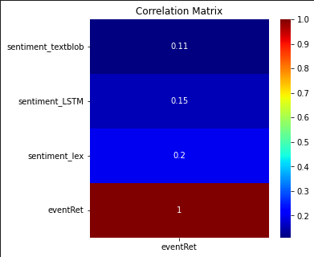
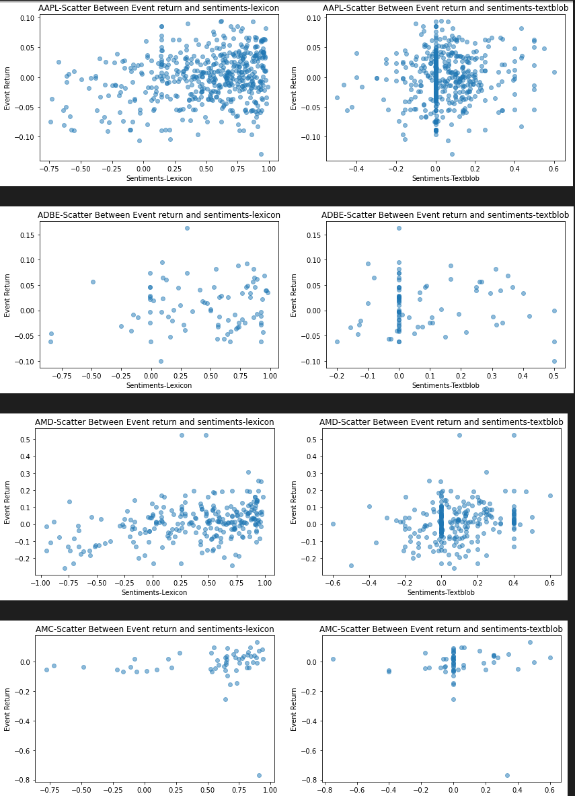
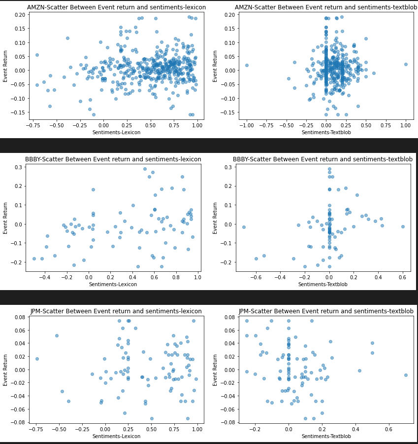
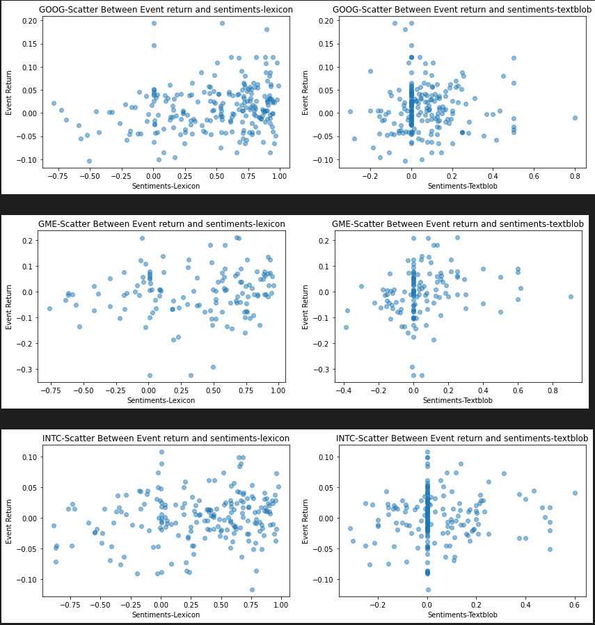
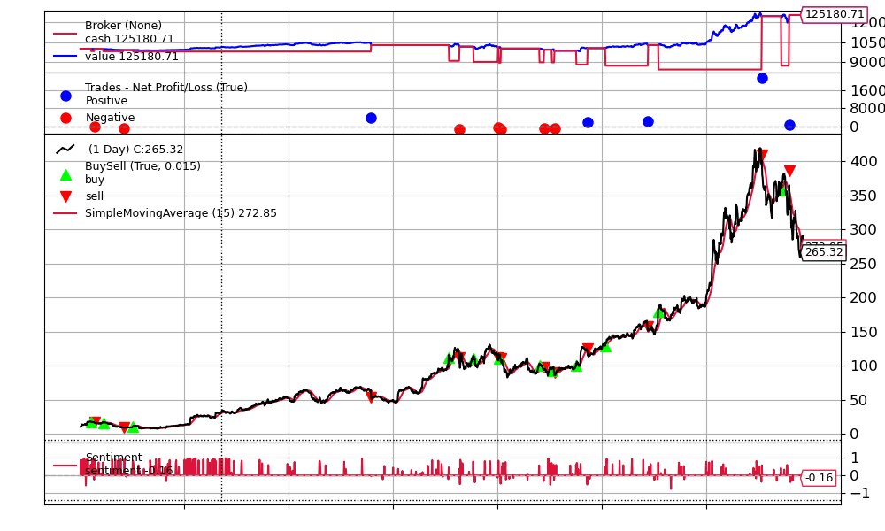
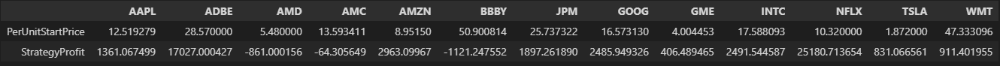

<h1> NLP - Trading Strategy </h1>

    <h4> The main goal of this project is to utilize NLP to extract informations from news headlines, assign th sentiment to the information, and build a sentiment trading analysis with backtrader. Backtrader is a finance library used for backtesting, to simulate a stock exchange market that automates buy/sell transaction. In this project, it will be solely be on sentiment analysis using Lexicon. Dataset used were parsed and compiled from several news website, Yahoo Finance, and labeled data from kaggle of news sentiments, and Stock Market Lexicon. </h4>
     
    <h4> Below is the correlation relationship between the NLP models and the event return, which is the profitability element. </h4> 
    
    <h4> Here we can see that all the sentiment has a positive relationship with eventRet. Though sentiment_lex has the highest amongst all algorithm, so we proceed on with that model. However, below is a scatter relationship between TextBlob and Lexicon </h4>
    
    
    
      
    <h2> Building the Trading Strategy (Model Evaluation) </h2>
    <h4> Sentiment data can be used in a separate way from the trading AI. Sentiment scores can be used as a signaling factor and ideally create a long-shortportfolio, by buying the stocks with positive scores and selling stocks with negative scores. They can also be used as additional features over and above other features (correlated stocks, technical indicators) in a supervised learning model to predict the price or come up with a trading strategy). 
    For this project, we buy and sell stock as per the currert stock sentiments.
    <li> Buy a stock when change in sentiment score is > than 0.5... sell when difference is < 0.5 </li>
    <li> Check 5 days moving average while buying and selling and buy/sell in bulk of 100 units </li> </h4>
    <h2> BackTrader </h2>
    <h4> We use backtrader, a python based API for backtesting and writing trading strategy. It allows us to focus on writing reusable trading strategies, indicators, and analyzers instead of having to spend time building the infrastructure. 
    https://www.backtrader.com/docu/quickstart/quickstart/  
    We impliment a simple strategy to buy if previous day's sentiment score increases by 0.5 from the last day and sell if it decreases by 0.5. 
    </h4>
    <h4> This visualization is one of many of the backtest result. refer to the images to view the other tickers list. </h4>
    
    <h4> The final dataframe shown below explains the profitability of each of the tickers in the second row. </h4>
    
    <h4> Here, we see that some securities led towards realized losses... (AMD, AMC, BBY), but fortunately, the others seemed to have gotten us positive gains over the long run. Most notably we see a good performance on Netflix security, where our trading automation had us gain $25,000 on sentiments on media headlines alone using NLP. This strategy can be modified with a custom trading rules or adding additional metrics to understand the performance of the strategy. Sentiments can especially be useful with techincal indicators like RSI, MOM, MA, etc... or other correlated variables. </h4>

<h6> None of this is considered financial advice, I will not be responsible for any transactions involving crypto or stock market. This is for educational purposes only. </h6>
