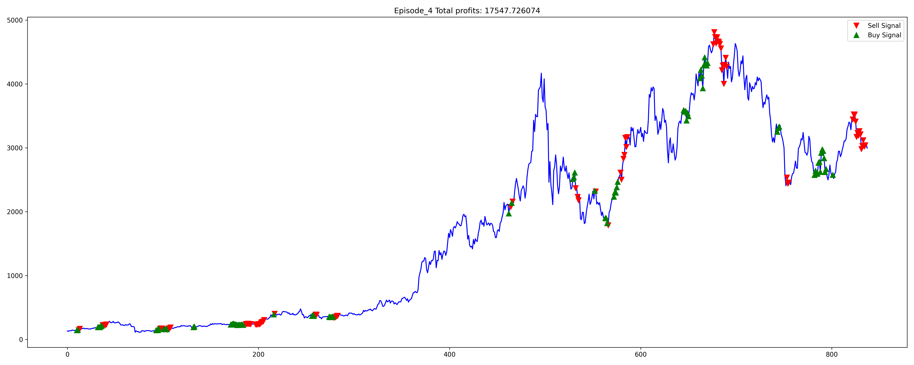
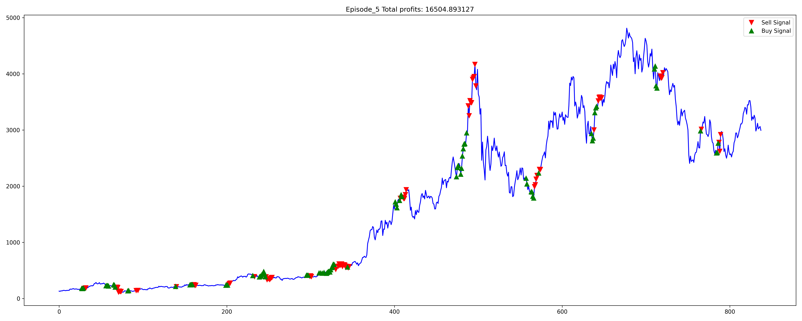
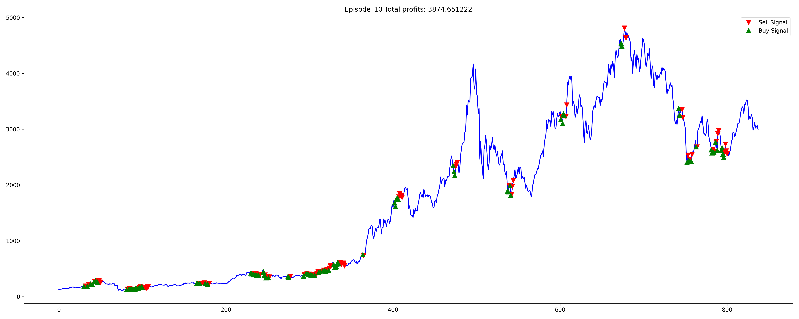
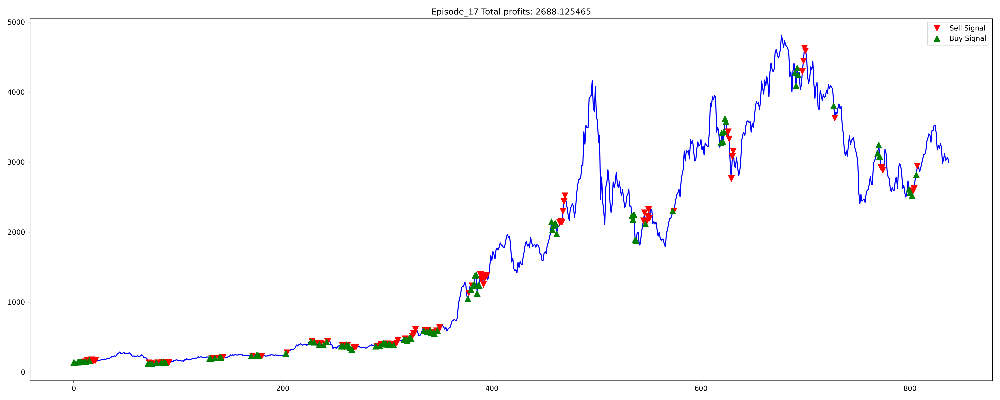

<head>
    <h1> Deep Q Learning </h1>
<head>

    <h2> Still in progress... Currently training 1000 phase before evaluating the final 20% of the test set. Below is an example of what's occuring in the training set.  
    I am currently working on a fix to see why my application is crashing on the 360+ episodes.
     
    
    
    
    
    
      
    </h2>
    <h2>Reinforcement Learning - Trading Strategy</h2>
    <h4>We'll have 3 components: POLICY DEVELOPMENT, PARAMETER OPTIMIZATION, BACKTEST  </h4>
    <h4><ul>Reinforcement components:<ul>
        <li>Agent = Trading</li>
        <li>Action = Buy/Sell/HODL</li>
        <li>Reward = Realized gains/losses</li>
        <li>Environment = Crypto Market Exchange</li>
    </h4>
     
    <h4>Deep Q Learning </h4>
    <h5>Deep Q Learning Algorithm approximates Q-values by learning sets of weights through series of hidden layers in the Deep Q-network that maps states to action... The algorithm aims to stabilize the training process of Q-learning through:
    <li>Experience replay</li><li>Periodic target update</li></h5>

